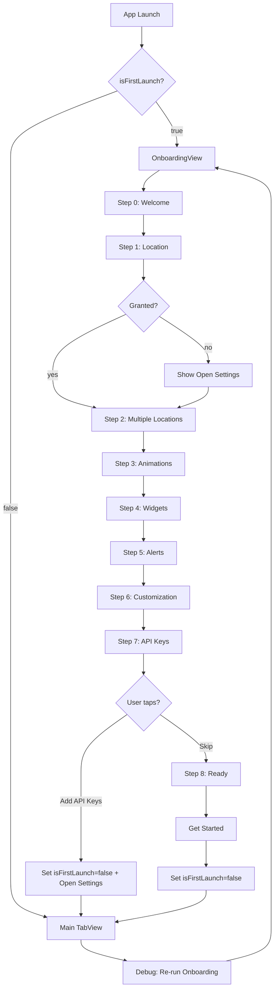

# Onboarding Overhaul + Debug Re-trigger Plan

## Overview

Two related changes:

1. **Full visual + content overhaul** of [`OnboardingView.swift`](SaxWeather/SaxWeather/OnboardingView.swift:1) — replace the current 4-step flow with a modern, paged, 8-step tour that showcases every key feature of SaxWeather (location, multiple locations, animations, widgets, alerts, customization, optional API keys).
2. **Debug menu entry** — add a "Re-run Onboarding" button to the existing **System** section of [`LottieDebugView.swift`](SaxWeather/SaxWeather/LottieDebugView.swift:390) so the flow can be triggered on demand during development.

---

## 1. New Onboarding Flow

### Design principles

- **Modern paged design** using `TabView(selection:)` with `.tabViewStyle(.page(indexDisplayMode: .never))` for native swipe-between-pages feel.
- **Custom progress indicator** (capsule row) at the bottom — matches the existing visual language but is more prominent.
- **Consistent per-page layout**: hero icon/illustration area → title → description → optional action button → page indicator → Back/Next/Get Started.
- **Smooth transitions** via `.transition(.asymmetric(...))` and `.animation(.spring(), value: currentStep)`.
- **Skip button** in the top-right of every page (except the final "Ready" page) so power users can bail out.
- **Back button** on every page except the first.
- **Location step** keeps the existing denied-handling pattern (Open Settings deep link via [`AppSettingsRouter`](SaxWeather/SaxWeather/Views/ErrorView.swift:306)).
- **API key step** is a *link-out* to Settings — no inline text fields. Tapping the button sets `isFirstLaunch = false` and posts a notification / sets a flag so Settings opens to the API keys section.

### Step breakdown

| # | Title | Purpose | Key UI |
|---|-------|---------|--------|
| 0 | **Welcome to SaxWeather** | Brand intro, tagline | App icon, gradient background |
| 1 | **Enable Location** | GPS permission request | `requestLocationPermission()` with denied → Open Settings path |
| 2 | **Save Multiple Locations** | Showcase `SavedLocationsManager` | List preview with mock locations + "Add later in Settings" |
| 3 | **Beautiful Animations** | Lottie weather animations | Mini Lottie preview (e.g. `clear-day`) + description |
| 4 | **Home Screen Widgets** | Widget support | Widget icon + description |
| 5 | **Severe Weather Alerts** | Notification opt-in | Bell icon + "Enable Alerts" button (calls `UNUserNotificationCenter.requestAuthorization`) |
| 6 | **Make It Yours** | Customization (backgrounds, accent, units) | Three small preview tiles |
| 7 | **Optional: API Keys** | Link to Settings | "Add API Keys in Settings" button (sets `isFirstLaunch = false` + opens Settings tab) |
| 8 | **You're All Set!** | Final CTA | "Get Started" button |

### Flow diagram

---

## 2. File Changes

### A. [`SaxWeather/SaxWeather/OnboardingView.swift`](SaxWeather/SaxWeather/OnboardingView.swift:1) — full rewrite

- Replace the single `steps` array + `currentStep` integer with a `TabView(selection: $currentStep)` using `.page` style.
- Each step becomes its own subview (`WelcomeStep`, `LocationStep`, `MultipleLocationsStep`, `AnimationsStep`, `WidgetsStep`, `AlertsStep`, `CustomizationStep`, `APIKeysStep`, `ReadyStep`) for readability.
- Shared chrome (progress indicator, Back/Next/Skip buttons) lives in the parent `OnboardingView`.
- Keep the existing `requestLocationPermission()` / `checkLocationPermission()` logic — just move it into `LocationStep`.
- Add a new `requestNotificationPermission()` helper for the alerts step.
- Add a new `openAPISettings()` helper that sets `isFirstLaunch = false` and posts a `Notification.Name.openSettingsToAPIKeys` notification (handled in `ContentView`).
- Keep the `OnboardingStep` struct or replace with per-step subviews (recommend subviews for richer layouts).

### B. [`SaxWeather/SaxWeather/ContentView.swift`](SaxWeather/SaxWeather/ContentView.swift:107) — minor update

- The existing call site `OnboardingView(isFirstLaunch: $isFirstLaunch, weatherService: weatherService)` should continue to work if we keep the same initializer signature.
- Add an `.onReceive(NotificationCenter.default.publisher(for: .openSettingsToAPIKeys))` that switches `selectedTab = 3` (Settings tab) when the onboarding API-keys step is tapped.

### C. [`SaxWeather/SaxWeather/LottieDebugView.swift`](SaxWeather/SaxWeather/LottieDebugView.swift:390) — add debug button

- In the `systemInfoSection`, add a new card titled **"Onboarding"** with:
  - Current state: `isFirstLaunch` value (✅ Completed / ⚠️ First launch)
  - Button: **"Re-run Onboarding"** — sets `UserDefaults.standard.set(true, forKey: "isFirstLaunch")` and posts a notification so `ContentView` re-presents the onboarding.
  - Button: **"Mark Onboarding Complete"** — sets it to `false` (useful for resetting after testing).
- Use the existing `debugActionButton(title:icon:color:action:)` helper for consistency.

### D. [`SaxWeather/SaxWeather/Localizable.xcstrings`](SaxWeather/SaxWeather/Localizable.xcstrings:1) — add new strings

- All new copy from the onboarding steps.
- Debug button labels.

---

## 3. Implementation Steps

1. **Rewrite [`OnboardingView.swift`](SaxWeather/SaxWeather/OnboardingView.swift:1)** with the new paged design and 8 subviews.
2. **Add notification name** for "open settings to API keys" (can live in `OnboardingView.swift` or a small `OnboardingNotifications.swift`).
3. **Update [`ContentView.swift`](SaxWeather/SaxWeather/ContentView.swift:107)** to listen for the notification and switch tabs.
4. **Add debug buttons** to `systemInfoSection` in [`LottieDebugView.swift`](SaxWeather/SaxWeather/LottieDebugView.swift:390).
5. **Update [`Localizable.xcstrings`](SaxWeather/SaxWeather/Localizable.xcstrings:1)** with new strings.
6. **Build & test** in simulator — verify:
   - First launch shows new onboarding.
   - Each step renders correctly.
   - Location permission flow works (granted + denied paths).
   - Notification permission prompt appears on alerts step.
   - API keys step links to Settings tab.
   - Debug "Re-run Onboarding" button resets and re-presents onboarding.
   - Skip button works on every page.

---

## 4. Key Design Decisions

- **TabView .page style** over manual swipe gestures — native, accessible, and handles VoiceOver automatically.
- **Subviews per step** over a single mega-view — easier to maintain and preview.
- **API keys step links out** rather than inline entry — keeps onboarding fast and respects the user's time; Settings is the right home for credential entry.
- **Debug button in System section** (not a new tab) — keeps the debug menu compact and consistent with existing patterns.
- **No new files** unless absolutely necessary — prefer extending existing files to minimize project.pbxproj churn.

---

## 5. Out of Scope

- Changing the `isFirstLaunch` storage mechanism (stays as `@AppStorage`).
- Adding analytics/telemetry to onboarding steps.
- A/B testing framework for onboarding variants.
- Localization beyond English (strings are added to `Localizable.xcstrings` so future translations are easy).
